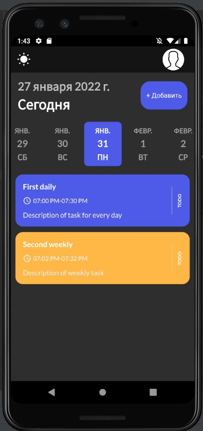
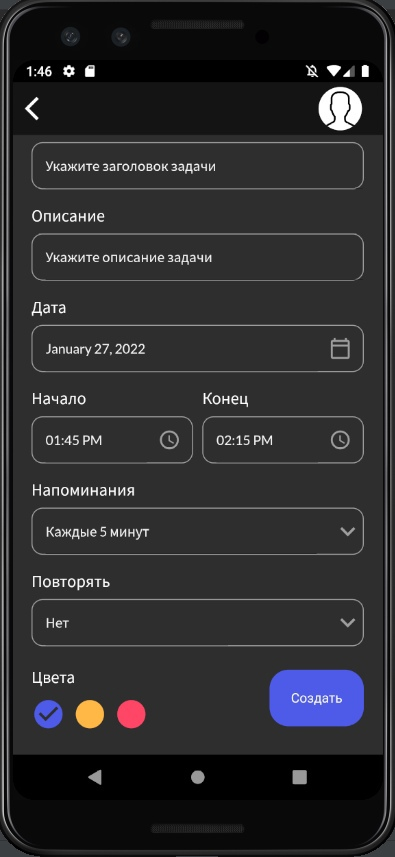
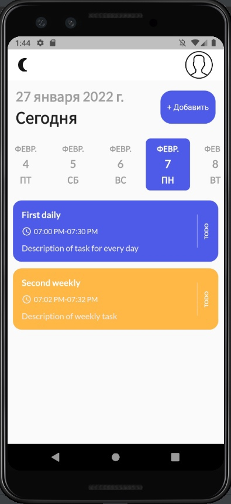
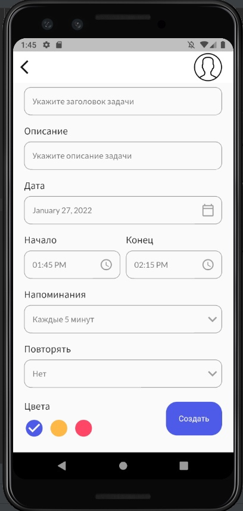

# Проект по изучению фреймворка Flutter

Создаем мобильное приложение для менеджмента задач Smart-ToDo.

## Список технологий (библиотек)

В процессе написания данного приложения я ознакомился:

- Библиотека для state-management, навигации и удобного внедрения зависимостей __GetX__
- Библиотека для удобного сохранения локальных данных __GetStorage__
- Библиотека для локальных уведомлений __flutter_local_notifications__
- Работа с локализацией __intl__ и часовыми зонами __timezone__
- Работа с базой данных Sqlite __sqflite__
- Ознакомился с анимацией __flutter_staggered_animations__

